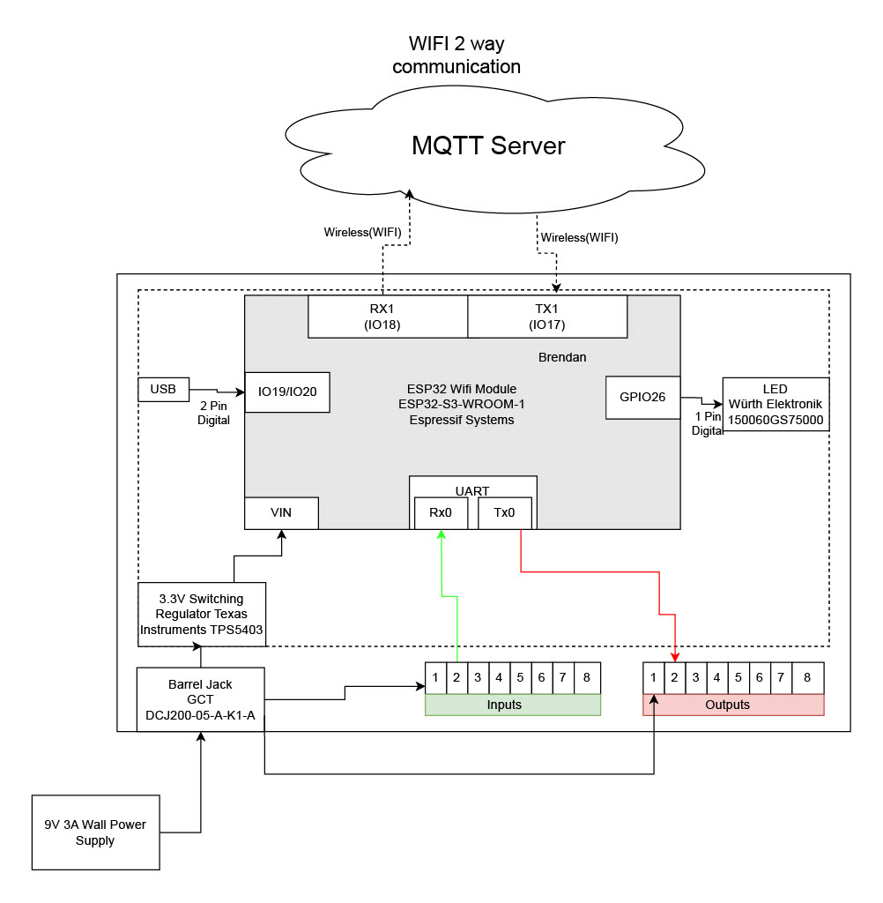

## Block Diagram of 2 way wifi communication

This block diagram is the MQTT communication portion of our project. The MQTT system is connected via WIFI communication with my microcontroller, the ESP32. The system included 2 different voltages on the board, a 9V which is going into both the voltage regulator and the header pins, and a 3.3V which goes directly into the ESP32. The ESP32 is connected to a USB port in able to code and an LED is being used for debugging purposes. The UART communication is taking in and sending out data from the other subsystems through pin 2 of the header pins.

My block diagram meets the requirements of the product as it allows for wifi communication with the rest of the team based on inputs from the user. When designing the block diagram, I had to make a decision on what would be the easiest way to communicate with the rest of my team members and decided upon UART communication as it allowed for easy communication with the rest of my team who was using PIC devices. 

One problem I ended up running into when designing the initial block diagram was forgetting to add a debugging LED. By forgetting that LED, it made it difficult to tell if the ESP32 was running or not.

[Block Diagram PDF](Block_Team203_Keeter.pdf)

[Block Diagram Source](https://drive.google.com/file/d/1lBq51Aa4LJ1upC8nbrsn0R02aSWhaZRm/view?usp=sharing)

