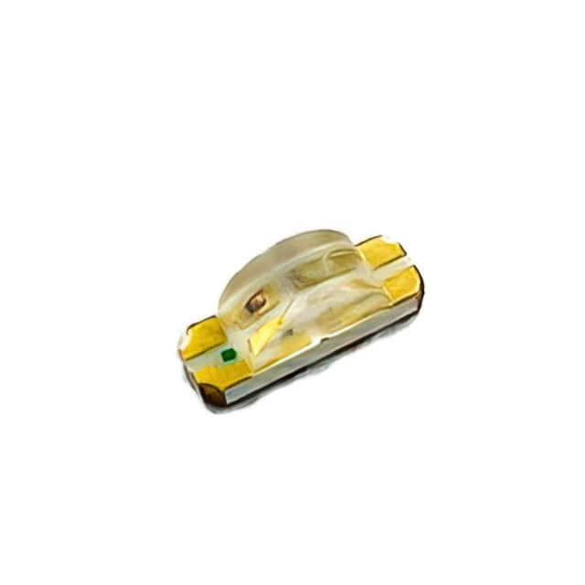
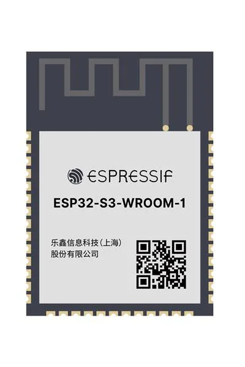
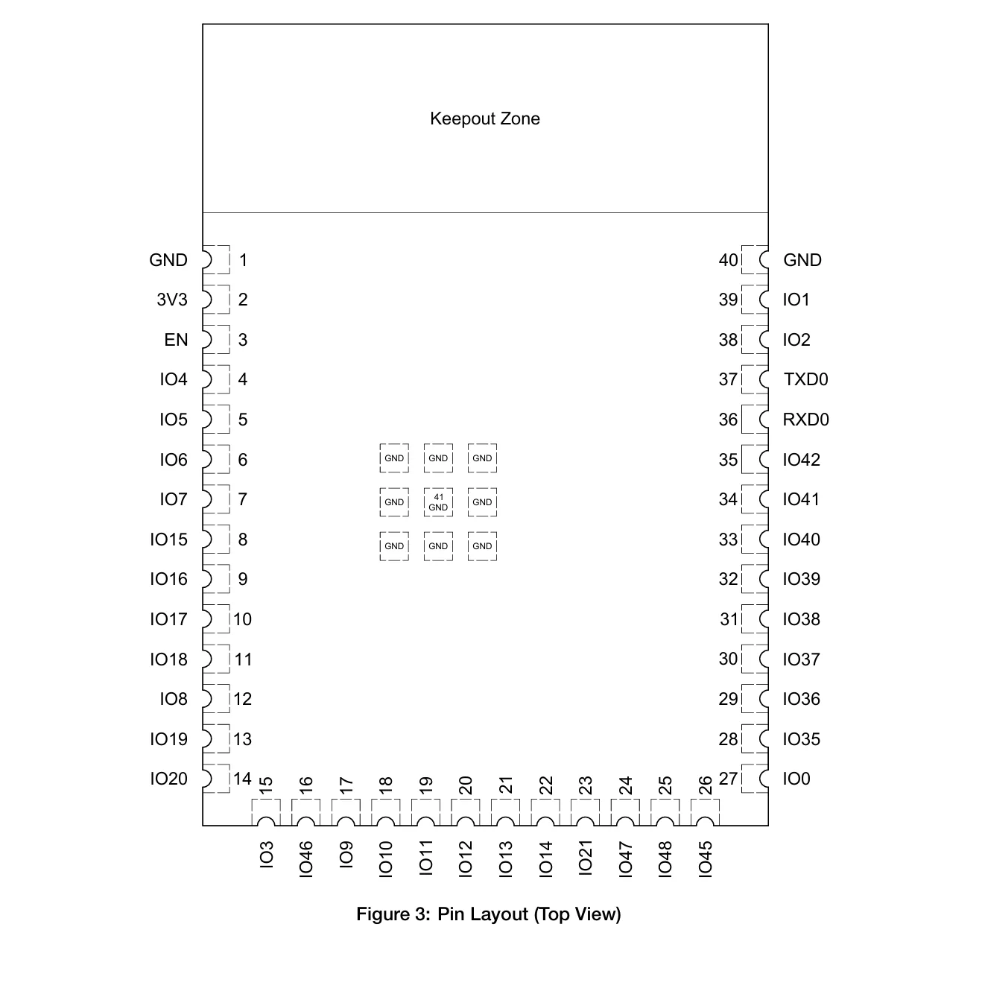
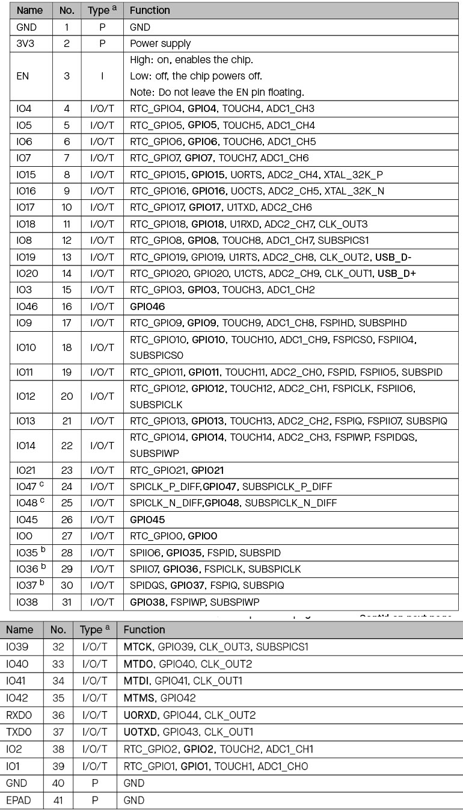
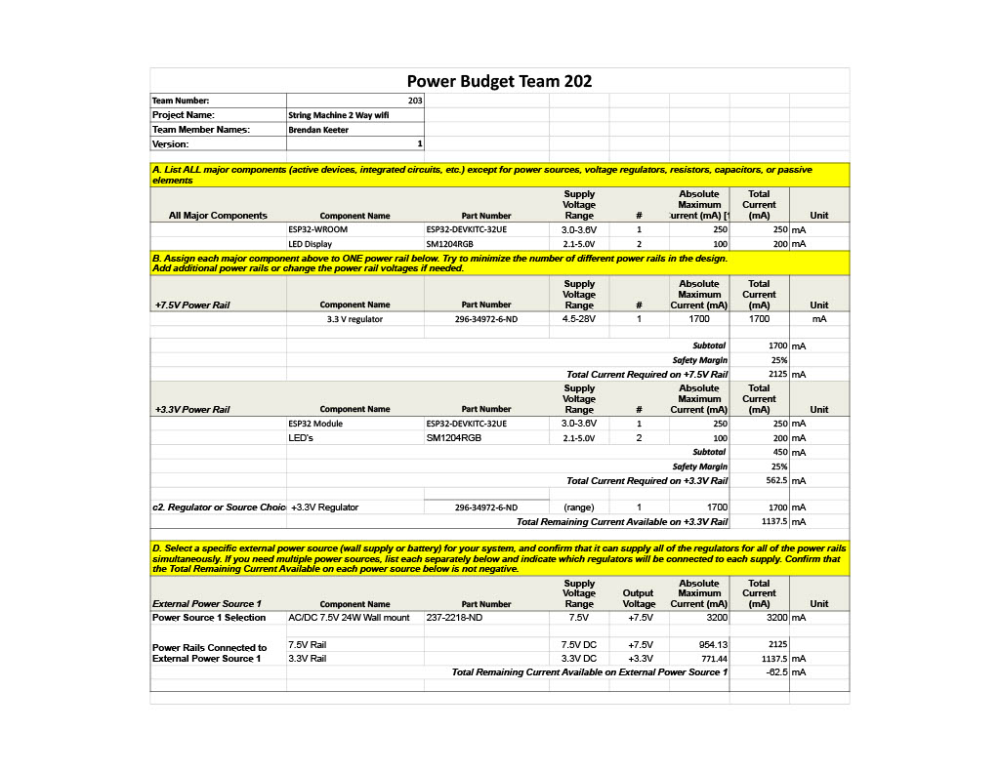

## Component Selection process and data sheet

### Major Components needed

1. Voltage regulator
2. LED display
3. Microcontroller

### Summary Table of components

Component         |  My Pick
------------------|--------------------------------------------------
Microcontroller   | ESP32-S3-WROOM-1
Voltage Regulator | Texas Instruments IC REG BUCK 3.3V 1.7A 8SOIC
LED Array         | Würth Elektronik LED GREEN CLEAR 0603 SMD

## Voltage Regulator
The voltage regulator is important to this subsystem as it limits the voltage and current into the microcontrollers to prevent spikes and drops of voltage and to improve performance of systems.

### Product 1: Texas Instruments IC REG BUCK 3.3V 1.7A 8SOIC

Pros                                                    |  Cons 
--------------------------------------------------------|----------------
High Output Amperage                                    | Lot of soldering pins
Lots of stock                                           | Very Small
Protective features for temperature and short circuits  | 
Switching Regulator                                     | 

[Link to Texas Instruments IC REG BUCK 3.3V 1.7A 8SOIC](https://www.digikey.com/en/products/detail/texas-instruments/TPS5403DR/3671578?gclsrc=aw.ds&&utm_adgroup=Texas%20Instruments&utm_source=google&utm_medium=cpc&utm_campaign=PMax%20Shopping_Supplier_Texas%20Instruments&utm_term=&utm_content=Texas%20Instruments&utm_id=go_cmp-17816159938_adg-_ad-__dev-c_ext-_prd-3671578_sig-CjwKCAiAt4C-BhBcEiwA8Kp0CTcF9FVzJ_Ko_nwXZIhZdF_5RF-trQQ9HqssRgeHgRn9RdPct75E1RoCdaAQAvD_BwE&gad_source=1&gclid=CjwKCAiAt4C-BhBcEiwA8Kp0CTcF9FVzJ_Ko_nwXZIhZdF_5RF-trQQ9HqssRgeHgRn9RdPct75E1RoCdaAQAvD_BwE&gclsrc=aw.ds)

### Product 2: Texas Instruments IC Voltage Regulator

Pros                      |  Cons 
--------------------------|----------------
Very Cheap                | Limited Stock
Good output amperage      | Small size
                          | Linear Regulator

[Link to Texas Instruments Voltage Regulator](https://www.digikey.com/en/products/detail/texas-instruments/TLV70245DBVT/3313487?gclsrc=aw.ds&&utm_adgroup=Texas%20Instruments&utm_source=google&utm_medium=cpc&utm_campaign=PMax%20Shopping_Supplier_Texas%20Instruments&utm_term=&utm_content=Texas%20Instruments&utm_id=go_cmp-17816159938_adg-_ad-__dev-c_ext-_prd-3313487_sig-CjwKCAiAtYy9BhBcEiwANWQQL6YN1oEZa4xfyE7WO1s_B3ArOTaa2NjwByYHu9_ywzZCVhIErApSexoC3EAQAvD_BwE&gad_source=1&gclid=CjwKCAiAtYy9BhBcEiwANWQQL6YN1oEZa4xfyE7WO1s_B3ArOTaa2NjwByYHu9_ywzZCVhIErApSexoC3EAQAvD_BwE&gclsrc=aw.ds)

### Product 3: Texas Instruments IC REG BOOST ADJ 980MA SOT23-6

Pros                      |  Cons 
--------------------------|----------------
Good size                 | Low max input Voltage
Easy soldering            | Low output Amperage
Boost switching regulator |

[Link to Texas Instruments IC REG BOOST ADJ 980MA SOT23-6](https://www.digikey.com/en/products/detail/texas-instruments/TLV61046ADBVR/8133008)

### Product choice for Voltage regulator: Product 1
The Texas Instruments IC REG BUCK 3.3V 1.7A 8SOIC voltage regulator is a powerful voltage regulator that works well within the parameters of my project. With the wall mount supplying power, it will successfully be able to regulator the voltage while sending the most amount of current into the system as well. The size of the regulator is small, however the datasheet offers a guide on how to successfully solder the surface mount voltage regulator. The price point for this voltage regulator is very good as well as it is only $1.60 for each part, this allows for the option to get the ones I would need for my project and then multiple extras in case of an issue with the part occurs.

## LED Array
The LED array is important as it allows for a physical signal that the Wifi module is working and that the product is on.

### Product 1: Bivar Inc. Surface Mount LED

Pros                      |  Cons 
--------------------------|----------------
Multiple color options    | Small size
Very visible lighting     | Fragile
                          | Difficult to solder

[Link to Bivar Inc. LED](https://www.digikey.com/en/products/detail/bivar-inc/SM1204RGB/22671473?gQT%3D0)

### Product 2: 5050 3-Chip LED

Pros               |  Cons 
-------------------|----------------
Very Cheap         | Limited color options
Easy to solder     | Limited datasheet imformation
Fast shipping      | 

[Link to 5050 3-Chip LED](https://www.superbrightleds.com/5050-smd-led-rgb-surface-mount-led-with-120-degree-viewing-angle-5050-smd-led?utm_campaign%3Dorganic-shopping%26utm_source%3Dgoogle%26utm_medium%3Dorganic%26utm_content%3D5050-RGB%26srsltid%3DAfmBOooJD4D2FlV9ukr4DnvELExSd1mPQ7Bp3z10UX3Wtdf2yv3rNDuDGCw%26gQT%3D0)

### Product 3: Würth Elektronik LED GREEN CLEAR 0603 SMD

Pros           |  Cons 
---------------|----------------
Good price     | Small (0603 size)
Very bright    | Slow shipping
Comes in bulk  | Only comes in green

[Würth Elektronik LED GREEN CLEAR 0603 SMD](https://www.digikey.com/en/products/detail/w-rth-elektronik/150060GS75000/4489896?gclsrc%3Daw.ds%26%26utm_adgroup%3D%26utm_source%3Dgoogle%26utm_medium%3Dcpc%26utm_campaign%3DPMax%20Shopping_Product_Medium%20ROAS%20Categories%26utm_term%3D%26utm_content%3D%26utm_id%3Dgo_cmp-20223376311_adg-_ad-__dev-c_ext-_prd-4489896_sig-Cj0KCQjwkZm_BhDrARIsAAEbX1FVawsae2_hcGH7fQbeBcZxQQZiAU5yU9fi9x5hAQCFyqkIZ7VKPicaAn9HEALw_wcB%26gad_source%3D1%26gclid%3DCj0KCQjwkZm_BhDrARIsAAEbX1FVawsae2_hcGH7fQbeBcZxQQZiAU5yU9fi9x5hAQCFyqkIZ7VKPicaAn9HEALw_wcB%26gclsrc%3Daw.ds)

### Product choice for LED Array: Product 3
The Würth Elektronik LED GREEN CLEAR 0603 SMD is the choice I ended up going with as, while it only comes in green, it is very powerful and long lasting. Its datasheet contains a lot of useful information on it on how to solder it and how to get different intensities of light from it, something that the other datasheets for LED's had lacked. It is very easy to solder and use for a PCB board as well.

## Microcontroller Information
### Microcontroller Used: ESP32-S3-WROOM-1

### Role of Subsystem
For the team, this subsystems role is to allow communication inputs from Wifi and Bluetooth. By gathering these inputs, this subsystem will then send data to the other subsystems of the project to physically perform the action selected. Once the data has been processed by the other subsystems, it will once again be received by this subsystem and sent back out via Wifi to the user.

The main focus of this subsystems responsibilities are sensing, display, and communication. For my subsystem, it will be responsible for sensing a button press from a user over Wifi or Bluetooth connection. As it receives this data, it will display something onto their device to allow them to see more information about what the project will be physically demonstrating. The main importance of this subsystem is communication. As the subsystem recieves inputs from the user, it is sending and recieving data to and from the other subsystems in order to physically demonstrate whichever option the user had selected. 

### ESP Information
ESP Info                      |   Data
------------------------------|------------------
Model                         | ESP32-S3-WROOM-1
Product page URL              | [Link](https://www.digikey.com/en/products/detail/espressif-systems/ESP32-S3-WROOM-1-N4R8/16163965?gad_source=1&gad_campaignid=20228387720&gbraid=0AAAAADrbLlirVJBj8dzWKfljP44YaLEQA&gclid=Cj0KCQjww-HABhCGARIsALLO6XzRQbiuax3_Zif1sDelSuuyqTRb7RIDk_LOgmr7FMjm3kEPv6Lh-BoaArf1EALw_wcB&gclsrc=aw.ds)
ESP32-S3-WROOM-1-N4 datasheet | [Link](https://www.espressif.com/sites/default/files/documentation/esp32-s3-wroom-1_wroom-1u_datasheet_en.pdf)
ESP32 S3 datasheet            | [Link](https://www.espressif.com/sites/default/files/documentation/esp32-wroom-32e_esp32-wroom-32ue_datasheet_en.pdf)
ESP32 S3 Technical Manual     | [Link](https://cdn-learn.adafruit.com/assets/assets/000/110/710/original/esp32-s3_technical_reference_manual_en.pdf?1649790877)
Vendor Link                   | [Link](https://www.digikey.com/en/products/detail/espressif-systems/ESP32-S3-WROOM-1-N4R8/16163965?gad_source=1&gad_campaignid=20228387720&gbraid=0AAAAADrbLlirVJBj8dzWKfljP44YaLEQA&gclid=Cj0KCQjww-HABhCGARIsALLO6XzRQbiuax3_Zif1sDelSuuyqTRb7RIDk_LOgmr7FMjm3kEPv6Lh-BoaArf1EALw_wcB&gclsrc=aw.ds)
Code Examples                 | [Link](https://github.com/espressif/esp-who/blob/master/docs/en/get-started/ESP32-S3-EYE_Getting_Started_Guide.md)
External Resources            | [Link 1: Getting Started](https://docs.espressif.com/projects/esp-idf/en/stable/esp32s3/get-started/index.html#what-you-need)    [Link 2: Complete Guide](https://www.nabto.com/guide-to-iot-esp-32/)
Unit Cost                     | $5.71
Supply Voltage Range          | Operating voltage is between 3.0V-3.6V. 3.3V Recommended
Absolute Max Current          | 500 mA
Maximum GPIO Current          | 40 mA
Supports External Interrupts? | Yes, it supports external interupts

### Pin Allocation

Peripheral      |  Pin Assignment (Name, Number)
----------------|----------------------
Power           | 3V3 , 2
Ground          | GND, 1 
                  GND, 40
USB             | IO19 (D-)
                  IO20 (D+)
UART            | TXD0 , 37
                  RXD0 , 36
GPIO            | GPIO36, 29            

### Decision making process

For this section, my decisionmaking had went into finding the best parts I could for each section. My subsystem does not need a ton of sensors on it which allowed me the option to spend more on certain parts to get what was needed for my product. The key requirements that were needed were serial communication, operating voltage of 3.3V, and a standard message structure that all 3 of our teams subsystems could use. 

The first major component I needed to select was the microcontroller I was using. The microcontroller I selected was the ESP32-S3-WROOM-1 module. This module allowed me the abilitiy to connect to Wifi and Bluetooth which were the most important parts of my products subsystem. These capabilities allow me to connect to MQTT and fulfill the main job of my specific subsystem. The ESP32 also comes with multiple UART ports which is important for our teams communication. Our team communicated via daisy chain, so being able to connect to Tx and Rx were very important factors needed. For the project as well, we had needed a 3.3V voltasge regulator which works well for the ESP32 module as 3.3V is the recommended voltage for operation. 

The next big component I needed to select was my voltage regulator. I ended up selecting the Texas Instruments IC REG BUCK 3.3V 1.7A 8SOIC. This voltage regulator was the one I went with as it fulfiled the main goal of bringing an external power source down to 3.3V for the ESP32 module. This voltage regulator was able to work for any input voltage between 4.5-20V, so it allowed me a wide variety of options for an external power source since I needed to find one that had enough amperage to satisfy not just my subsystem, but also the subsystems I was sending power to as well. 

Finally I had selected the LED array that I chose as it was a very simple part to solder, was very bright, and had a long lasting life span. The LED helped with debugging my board as I tested it alongside the code and letting me know that the board was in active use when the LED was turned on. 

These parts allowed me to fulfill the role of my subsystem to create an interactive experience for our user as they all allowed me to take communication sent by my other team members subsystems and display them via MQTT communication.

## Power Budget

[Power Budget PDF](<power budget - Sheet1.pdf>)

[Power Budget Link](https://docs.google.com/spreadsheets/d/1vRoSXK202q8WlBCtyZgGOLbRly6qO8YX6i80h-ZgNSs/edit?usp=sharing)

By creating this power budget, I was able to see just how much current and voltage I would need to get my system running properly with a 25% safety cushion if every system were to run at maximum current. The one thing I found when making my power budget was that I needed a wall mount power source that had a bit more current due to the maximum current that my voltage regulator was going to need. For the power budget, when totalling the maximum current for everything with the wall mounts power, the remaining current is very close to 0 mA, however I will not be needing to run every part of my subsystem at maximum current at any time.

This schematic helps to satisfy user needs and requirement for our product as it allows for successful communication through Wifi. The schematic itself is very simple as most of the resources will be in coding, however it was important to our team that there be UART communication and LED's to communicate between each of our subsystems and also be able to shine an LED to inform the user that they are connected to the Wifi module. It helps us to meet our user needs as it allows for the user to get extra resources to learn from as an input is being recognized by our project.