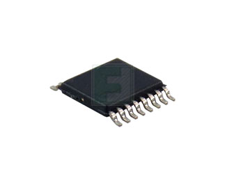
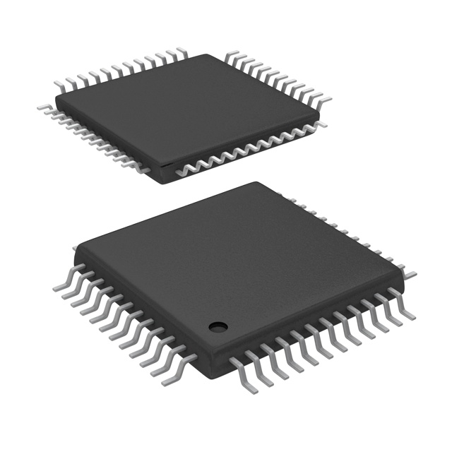

## Component Selection process and data sheet

### Major Components needed

1. UART Module
2. Voltage regulator
3. LED display
4. PIC Microcontroller
5. Wifi Module

## UART Products
### Product 1: MaxLinear UART Interface IC

Pros                 |  Cons 
---------------------|----------------
 Fast transmit speed | More ports than needed
Fast Shipping        | Large product
                     | Most expensive option

[Link to MaxLinear UART](https://www.mouser.com/ProductDetail/MaxLinear/ST16C554CQ64-F?qs%3DsGAEpiMZZMuyKkoWRCJ2WK2LkBH%2Fe8DzpnRsCY%2FOJKM%3D)

### Product 2: NXP SC16IS740IPW UART

Pros                      |  Cons 
--------------------------|----------------
Very Cheap                | Limited Stock
Good size for board       | Slow shipping
Fast data transfer speed  | Limited Channels

[Link to NXP Uart](https://www.futureelectronics.com/p/semiconductors--signal-interface--uart/sc16is740ipw-112-nxp-7849771)

### Product 3: Texas Instruments IC Dual UART

Pros                      |  Cons 
--------------------------|----------------
Fast Shipping time        | Very big size
Multiple UART terminals   | Limited Stock

[Link to Texas Instruments UART](https://www.digikey.com/en/products/detail/texas-instruments/TL16C2550PFBR/2451287?gQT=2)

## Voltage Regulator
### Product 1: Diodes Incorporated IC Linear Voltage Regulator

Pros                                                    |  Cons 
--------------------------------------------------------|----------------
Very Cheap                                              | Limited output amperage
Lots of stock                                           | Fragile
Protective features for temperature and short circuits  | Very small

[Link to diodes Incorporated Voltage Regulator](https://www.digikey.com/en/products/detail/diodes-incorporated/AS78L05RTR-G1/8545831?gQT=1)

### Product 2: Texas Instruments IC Voltage Regulator

Pros                      |  Cons 
--------------------------|----------------
Very Cheap                | Limited Stock
Good output amperage      | Small size

[Link to Texas Instruments Voltage Regulator](https://www.digikey.com/en/products/detail/texas-instruments/TLV70245DBVT/3313487?gclsrc=aw.ds&&utm_adgroup=Texas%20Instruments&utm_source=google&utm_medium=cpc&utm_campaign=PMax%20Shopping_Supplier_Texas%20Instruments&utm_term=&utm_content=Texas%20Instruments&utm_id=go_cmp-17816159938_adg-_ad-__dev-c_ext-_prd-3313487_sig-CjwKCAiAtYy9BhBcEiwANWQQL6YN1oEZa4xfyE7WO1s_B3ArOTaa2NjwByYHu9_ywzZCVhIErApSexoC3EAQAvD_BwE&gad_source=1&gclid=CjwKCAiAtYy9BhBcEiwANWQQL6YN1oEZa4xfyE7WO1s_B3ArOTaa2NjwByYHu9_ywzZCVhIErApSexoC3EAQAvD_BwE&gclsrc=aw.ds)

### Product 3: Texas Instruments LDO Voltage Regulator

Pros                      |  Cons 
--------------------------|----------------
Good size                 | Most expensive option of the 3
High Output current       | May not need all the pins for project
Dual voltage regulator    | 

[Link to Texas Instruments LDO voltage regulator](https://www.mouser.com/ProductDetail/Texas-Instruments/TPS70102PWP?qs%3DbkMXpVdiF41JmXPuczOpzA%3D%3D%26mgh%3D1%26srsltid%3DAfmBOoqtSqjdChy1NdfwYW6UW45uYxGgOzW0J132YBuycw3jOd45rfBqCuM%26gQT%3D1)

