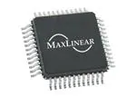

## Component Selection process and data sheet

### Major Components needed

1. UART Module
2. 12V Wall Power Supply
3. PIC Microcontroller
4. Wifi Module
5. Voltage regulator
6. LED display

## UART Products
### Product 1: MaxLinear UART Interface IC

Pros                 |  Cons 
---------------------|----------------
Inexpensive          | More ports than needed
Fast Shipping        | Large product
Fast transmit speed  |

[Link to UART 1](https://www.mouser.com/ProductDetail/MaxLinear/ST16C554CQ64-F?qs%3DsGAEpiMZZMuyKkoWRCJ2WK2LkBH%2Fe8DzpnRsCY%2FOJKM%3D)