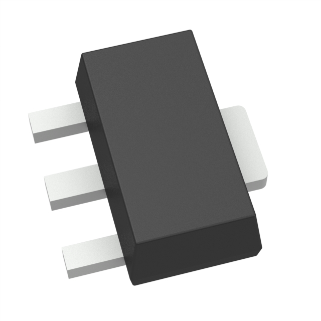
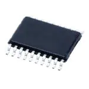
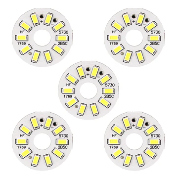

## Component Selection process and data sheet

### Major Components needed

1. Voltage regulator
2. LED display
3. Microcontroller

## Voltage Regulator
The voltage regulator is important to this subsystem as it limits the voltage and current into the microcontrollers to prevent spikes and drops of voltage and to improve performance of systems.

### Product 1: Diodes Incorporated IC Linear Voltage Regulator

Pros                                                    |  Cons 
--------------------------------------------------------|----------------
Very Cheap                                              | Limited output amperage
Lots of stock                                           | Fragile
Protective features for temperature and short circuits  | Very small

[Link to diodes Incorporated Voltage Regulator](https://www.digikey.com/en/products/detail/diodes-incorporated/AS78L05RTR-G1/8545831?gQT=1)

### Product 2: Texas Instruments IC Voltage Regulator

Pros                      |  Cons 
--------------------------|----------------
Very Cheap                | Limited Stock
Good output amperage      | Small size

[Link to Texas Instruments Voltage Regulator](https://www.digikey.com/en/products/detail/texas-instruments/TLV70245DBVT/3313487?gclsrc=aw.ds&&utm_adgroup=Texas%20Instruments&utm_source=google&utm_medium=cpc&utm_campaign=PMax%20Shopping_Supplier_Texas%20Instruments&utm_term=&utm_content=Texas%20Instruments&utm_id=go_cmp-17816159938_adg-_ad-__dev-c_ext-_prd-3313487_sig-CjwKCAiAtYy9BhBcEiwANWQQL6YN1oEZa4xfyE7WO1s_B3ArOTaa2NjwByYHu9_ywzZCVhIErApSexoC3EAQAvD_BwE&gad_source=1&gclid=CjwKCAiAtYy9BhBcEiwANWQQL6YN1oEZa4xfyE7WO1s_B3ArOTaa2NjwByYHu9_ywzZCVhIErApSexoC3EAQAvD_BwE&gclsrc=aw.ds)

### Product 3: Texas Instruments LDO Voltage Regulator

Pros                      |  Cons 
--------------------------|----------------
Good size                 | Most expensive option of the 3
High Output current       | May not need all the pins for project
Dual voltage regulator    | 

[Link to Texas Instruments LDO voltage regulator](https://www.mouser.com/ProductDetail/Texas-Instruments/TPS70102PWP?qs%3DbkMXpVdiF41JmXPuczOpzA%3D%3D%26mgh%3D1%26srsltid%3DAfmBOoqtSqjdChy1NdfwYW6UW45uYxGgOzW0J132YBuycw3jOd45rfBqCuM%26gQT%3D1)

### Product choice for Voltage regulator: Product 2
The Texas Instruments IC Voltage Regulator is the option I chose as it is both the correct size and amperage that is needed for this subsystem of the project. While the other 2 options were both good choices, product 1 was very limited in its capacity to output amperage and would be very difficult to solder based on its size. Product 3 was very good, however it had more pins than needed for this part of the project, so product 2 was perfect in both total pins and ease for soldering.

## LED Array
The LED array is important as it allows for a physical signal that the Wifi module is working and that the product is on.

### Product 1: Bivar Inc. Surface Mount LED

Pros                      |  Cons 
--------------------------|----------------
Multiple color options    | Small size
Very visible lighting     | Fragile
                          | Difficult to solder

[Link to Bivar Inc. LED](https://www.digikey.com/en/products/detail/bivar-inc/SM1204RGB/22671473?gQT%3D0)

### Product 2: 5050 3-Chip LED

Pros               |  Cons 
-------------------|----------------
Very Cheap         | Limited color options
Easy to solder     | Limited datasheet imformation
Fast shipping      | 

[Link to 5050 3-Chip LED](https://www.superbrightleds.com/5050-smd-led-rgb-surface-mount-led-with-120-degree-viewing-angle-5050-smd-led?utm_campaign%3Dorganic-shopping%26utm_source%3Dgoogle%26utm_medium%3Dorganic%26utm_content%3D5050-RGB%26srsltid%3DAfmBOooJD4D2FlV9ukr4DnvELExSd1mPQ7Bp3z10UX3Wtdf2yv3rNDuDGCw%26gQT%3D0)

### Product 3: Uxcell 300ma 5W LED's

Pros           |  Cons 
---------------|----------------
Big Size       | most expensive option
Very bright    | Slow shipping
Comes in bulk  |

[Link to Uxcell 5W LED](https://www.harfington.com/products/p-g0371e78e?currency%3DUSD%26variant%3D42123817255161%26utm_source%3Dgoogle%26utm_medium%3Dcpc%26utm_campaign%3DGoogle%2BShopping%26stkn%3Df8e35277684b%26srsltid%3DAfmBOopDPs2dY0Yu_6We4VzthXQTzpV-xCvpU5PApDJU0VGKCbteNZTKDkA%26gQT%3D0)

### Product choice for LED Array: Product 1
The Bivar Inc. Surface Mount LED was the choice made for this subsystem based on its visibility and the ability to shine in different colors other than just white. Product 2 was a good product, however it did not have a lot of datasheet information, which could've caused difficulty down the line with specifics when in use. Product 3 was well designed, however it being the most expensive and slow to ship was its downside. While a downside of the Bivar Inc. LED is its size, its brightness and ability to change colors were the key factors to making this choice.

## Microcontroller Information
### Microcontroller Used: Expressif ESP32 chip

.png>)
.png>)

### Role of Subsystem
For the team, this subsystems role is to allow communication inputs from Wifi and Bluetooth. By gathering these inputs, this subsystem will then send data to the other subsystems of the project to physically perform the action selected. Once the data has been processed by the other subsystems, it will once again be received by this subsystem and sent back out via Wifi to the user.
The main focus of this subsystems responsibilities are sensing, display, and communication. For my subsystem, it will be responsible for sensing a button press from a user over Wifi or Bluetooth connection. As it receives this data, it will display something onto their device to allow them to see more information about what the project will be physically demonstrating. The main importance of this subsystem is communication. As the subsystem recieves inputs from the user, it is sending and recieving data to and from the other subsystems in order to physically demonstrate whichever option the user had selected. 

### ESP Information
ESP Info                      |   Data
------------------------------|------------------
Model                         |      
Product page URL              |                 
ESP32-S3_WROOM-1-N4 datasheet |
ESP32 S3 datasheet            | 
ESP32 S3 Technical Manual     | 
Vendor Link                   |
Code Examples                 |
External Resources            | 
Unit Cost                     |
Absolute Max Current          | 
Maximum GPIO Current          | 
Supports External Interrupts? | 
Required Hardware             | 

Module         | # Available      |  Needed    | Associated Pins
---------------|------------------|------------|-----------------------
UART           |                  |            | 
External SPI   |                  |            |
I2C            |                  |            | 
GPIO           |                  |            | 
ADC            |                  |            | 
LED PWM        |                  |            | 
Motor PWM      |                  |            | 
USB Programmer |