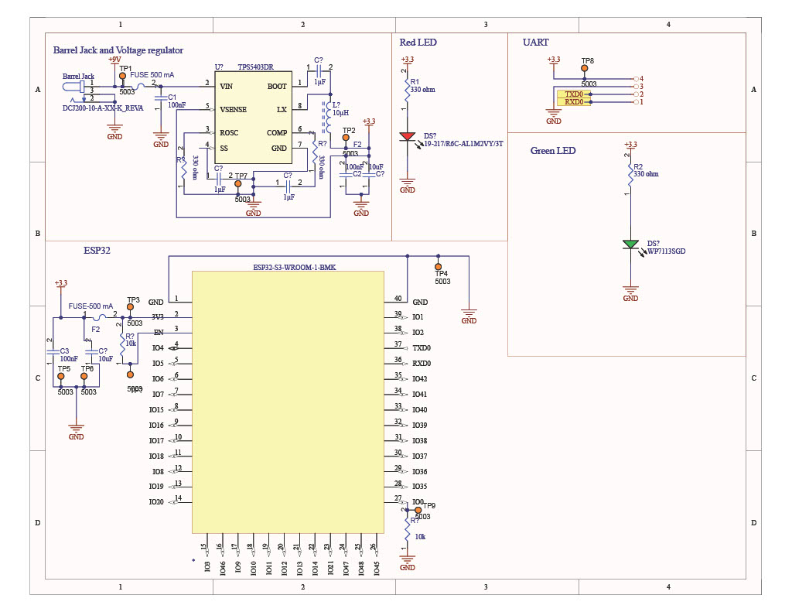

## Schematic

### Schematic Design

 

[Link to schematic PDF](schematic.pdf)

[Zip File](<../../../../Desktop/School Programs/2025 spring/Wifi Communication.zip>)

### Power Budget

[Power Budget PDF](<power budget - Sheet1.pdf>)

[Power Budget Link](https://docs.google.com/spreadsheets/d/1vRoSXK202q8WlBCtyZgGOLbRly6qO8YX6i80h-ZgNSs/edit?usp=sharing)

By creating this power budget, I was able to see just how much current and voltage I would need to get my system running properly with a 25% safety cushion if every system were to run at maximum current. The one thing I found when making my power budget was that I needed a wall mount power source that had a bit more current due to the maximum current that my voltage regulator was going to need. For the power budget, when totalling the maximum current for everything with the wall mounts power, the remaining current is very close to 0 mA, however I will not be needing to run every part of my subsystem at maximum current at any time.

This schematic helps to satisfy user needs and requirement for our product as it allows for successful communication through Wifi. The schematic itself is very simple as most of the resources will be in coding, however it was important to our team that there be UART communication and LED's to communicate between each of our subsystems and also be able to shine an LED to inform the user that they are connected to the Wifi module. It helps us to meet our user needs as it allows for the user to get extra resources to learn from as an input is being recognized by our project.